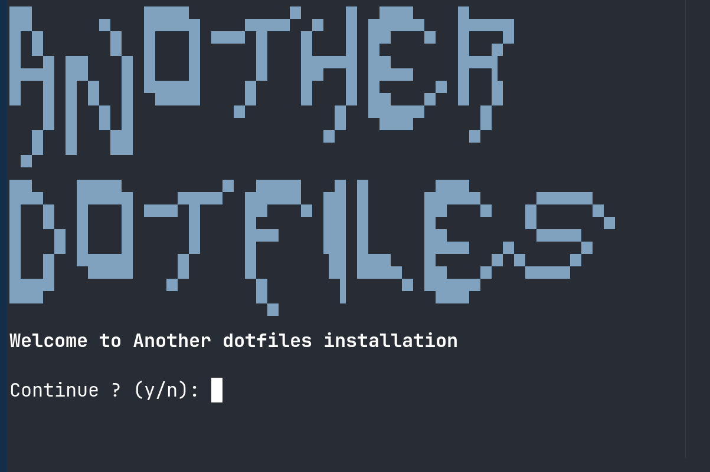
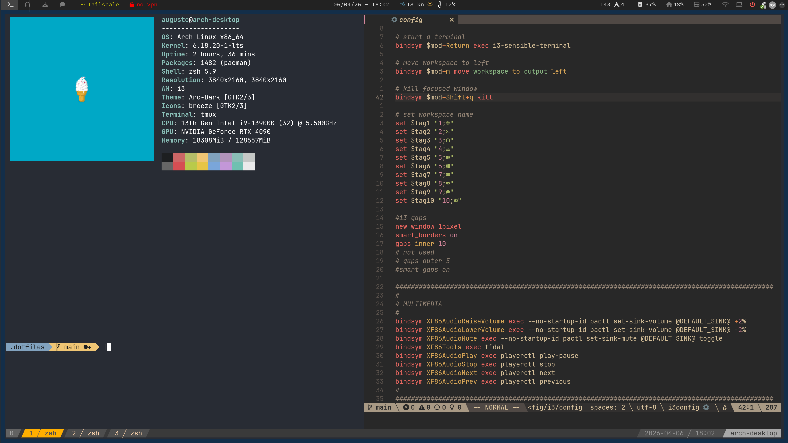

# ⚡ Another Dotfiles


[](https://opensource.org/licenses/MIT)
[](https://www.kernel.org/)
[](https://www.zsh.org/)
[](https://www.vim.org/)
[](https://i3wm.org/)
[](https://tmux.github.io/)
[](https://polybar.github.io/)
[](https://davedavenport.github.io/rofi/)

A curated collection of dotfiles optimized for a lightweight **Arch + i3wm** workflow. Keyboard-driven productivity configurations for i3 window manager, tmux terminal multiplexer, polybar status bar, rofi launcher, and more.

<p align="center">
    
</p>


## Preview 
<p align="center">
    
</p>

## Features

### Core Components
- **i3 Tiling Window Manager** - Keyboard-driven layout with custom workspaces, animations, multimedia keys, and auto-start applications
- **tmux Terminal Multiplexer** - 256-color terminal, Vi keybindings, mouse support, copy-paste integration, and pane synchronization
- **polybar Status Bar** - Real-time system metrics (CPU, memory, battery, network, temperature), custom audio/network modules, and weather support
- **rofi Application Launcher** - DRun, Run, SSH, and Window modes with themed squared-nord design
- **ZSH/Vim/Dunst/Picom** - Complete shell, editor, and UI configuration suite

## Installation

Choose your preferred installation method:

## Quick Install

To install all configurations and shell basics in one go, run:

```bash
curl -sSL https://raw.githubusercontent.com/moraisaugusto/another-dotfiles/main/install.sh | bash -s -- install-all
```
<p align="center">
</p>

### Option 1: Using Make (Recommended for simple setups)
```bash
cd ~/.dotfiles
make all
```
This installs all configurations in one command.

### Option 2: Using Make for specific components
```bash
cd ~/.dotfiles

# Install everything
make all

# Install specific components
make shell
make configs    # All applications
make i3         # i3 window manager
make tmux       # tmux terminal
make polybar    # polybar status bar
make rofi       # rofi launcher

# Remove all configurations
make delete
```

### Option 3: Using Stow (Recommended for advanced users)
```bash
cd ~/.dotfiles
git submodule update --init --recursive
stow .
source zsh
```


## Requirements

### System
- Linux or systemd-based distribution
- i3 (4+), ZSH (5+), polybar, rofi
- Terminal emulator (URXVT, Termite, Ghostty)

### Essential Packages (Arch)

```bash
sudo pacman -S i3 i3-gaps polybar rofi zsh vim dunst picom \
  scrot feh xsel git tmux xautolock i3lock archlinux-wallpaper \
  networkmanager pulseaudio pamixer brightnessctl
```


## Quick Start Keybindings

### i3 Window Manager (Mod4/Super)
- `Mod4+d` - Open rofi launcher
- `Mod4+hjkl` - Move focus cursor
- `Ctrl+a | -` - Split pane vertically/horizontally
- `Mod4+1-0` - Switch workspace
- `Mod4+Shift+q` - Kill window
- `Mod4+f` - Toggle fullscreen
- `Mod4+r` - Enter resize mode

### tmux Terminal (Ctrl+a)
- `Ctrl+a+c` - New window
- `Ctrl+a+d` - Detach session
- `Ctrl+a+hjkl` - Navigate panes

### Polybar Status Bar
- **Middle click** audio module - Mute toggle
- **Scroll** audio module - Volume adjust
- **Left click** monitor module - Open arandr

### Rofi Launcher
- `Super+d` - Applications
- `Ctrl+Alt` - Switch modes


## Complete Documentation

### tmux Advanced Use
**Navigate to previous/next window:**
```bash
Ctrl+a, or Ctrl+a+.
```

**Switch pane orientation:**
```bash
Ctrl+a+; or Ctrl+a+'
```

**Copy text:**
```bash
Ctrl+a+[ Enter, then select text, Enter to copy
Ctrl+a+ = Paste from clipboard
```


## Directory Structure

```
~/.another-dotfiles/
├── my-configs
│   ├── config
│   ├── direnv
│   ├── dunst
│   ├── i3
│   ├── mpv
│   ├── nautilus
│   ├── picom
│   ├── polybar
│   ├── rofi
│   ├── tmux
│   ├── tmuxinator
│   ├── tmux-powerline
│   └── zathura
└─── shell-basics
    ├── dot-conkyrc
    ├── dot-XCompose
    ├── dot-xprofile
    ├── dot-Xresources
    ├── dot-xsessionrc
    ├── dot-zshAlias
    └── dot-zshrc
```


---

## License

MIT License - see LICENSE file for details.

---
