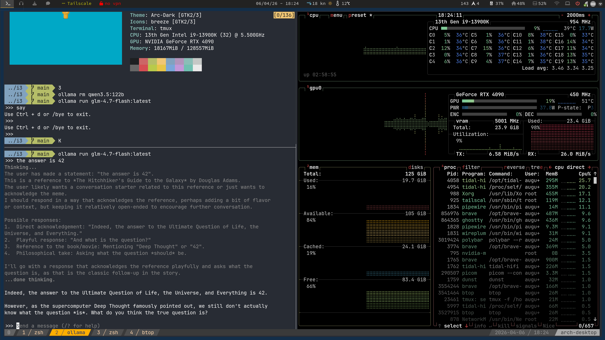

# Dotfiles

[](https://opensource.org/licenses/MIT)
[](https://www.kernel.org/)
[](https://www.zsh.org/)
[](https://neovim.io/)
[](https://i3wm.org/)
[](https://tmux.github.io/)
[](https://polybar.github.io/)
[](https://github.com/davatorium/rofi/)
[]()
[](https://archlinux.org/)

A curated collection of dotfiles for a lightweight **Arch Linux + i3-gaps** workflow. Keyboard-driven productivity configurations for i3 window manager, tmux terminal multiplexer, polybar status bar, rofi launcher, and more.

<p align="center">
    
    <br><em>Installation in action</em>
</p>


## Preview

<p align="center">
    
    
    <br><em>Terminal workflow with tmux and polybar</em>
</p>

---

## Table of Contents

<details open>
<summary><strong>Click to expand/collapse</strong></summary>

- [Features](#features)
  - [Core Components](#core-components)
  - [Supported Applications](#supported-applications)
- [Installation](#installation)
  - [Quick Install](#quick-install)
  - [Option 1: Using Make (Recommended)](#option-1-using-make-recommended)
  - [Option 2: Using Stow](#option-2-using-stow)
  - [Requirements](#requirements)
  - [Uninstall](#uninstall)
- [Quick Start Keybindings](#quick-start-keybindings)
  - [i3 Window Manager](#i3-window-manager-mod4super)
  - [tmux Terminal](#tmux-ctrla)
  - [Polybar Status Bar](#polybar-status-bar)
  - [Rofi Launcher](#rofi-launcher)
- [Workspace Assignments](#workspace-assignments)
- [Neovim Configuration](#neovim-configuration)
- [Directory Structure](#directory-structure)
- [Git Submodules](#git-submodules)
- [Troubleshooting](#troubleshooting)
- [Known Issues & Limitations](#known-issues--limitations)
- [Contributing](#contributing)
- [Changelog](#changelog)
- [License](#license)

</details>

---

## Features

### Core Components
- **i3-gaps Tiling Window Manager** - Keyboard-driven layout with custom workspaces, gaps, multimedia keys, and auto-start applications
- **tmux Terminal Multiplexer** - 256-color terminal, Vi keybindings, mouse support, copy-paste integration, and pane synchronization
- **polybar Status Bar** - Real-time system metrics (CPU, memory, battery, network, temperature), custom audio/network modules, weather and VPN support
- **rofi Application Launcher** - DRun, Run, SSH, and Window modes with themed squared-nord design
- **ZSH/Neovim/Dunst/Picom** - Complete shell, editor, and UI configuration suite

### Supported Applications
- **Terminals**: Ghostty, URXVT
- **Browsers**: Brave, Chromium, Firefox
- **Media**: Spotify, Tidal, mpv
- **File Managers**: Thunar, Nautilus

## Installation

Choose your preferred installation method:

### Quick Install

To install all configurations and shell basics in one go, run:

```bash
curl -sSL https://raw.githubusercontent.com/moraisaugusto/another-dotfiles/main/install.sh | bash -s -- install-all
```

### Option 1: Using Make (Recommended)

```bash
cd ~/.dotfiles
make all
```

Install specific components:
```bash
make shell      # ZSH and shell basics
make configs    # All applications
make i3         # i3 window manager
make tmux       # tmux terminal
make polybar    # polybar status bar
make rofi       # rofi launcher
```

Remove all configurations:
```bash
make delete
```

### Option 2: Using Stow (Recommended for advanced users)

```bash
cd ~/.dotfiles
git submodule update --init --recursive
stow --dotfiles -v shell-basics
stow --dotfiles -vv -d my-configs -t ~ i3
```

Apply individual configurations:
```bash
# From my-configs directory
stow --dotfiles -vv -d my-configs -t ~ tmux
stow --dotfiles -vv -d my-configs -t ~ polybar
stow --dotfiles -vv -d my-configs -t ~ rofi

# From root directory (shell-basics)
stow --dotfiles -v shell-basics
```

## Requirements

### System
- Linux distribution (Arch-based recommended)
- i3-gaps (4.x+), ZSH (5+), polybar, rofi
- Terminal emulator (URXVT, Ghostty, etc.)

### Essential Packages (Arch)

```bash
sudo pacman -S i3-gaps polybar rofi zsh neovim dunst picom \
  scrot feh xsel git tmux xautolock networkmanager \
  pulseaudio pamixer brightnessctl xdotool
```

## Quick Start Keybindings

### i3 Window Manager (Mod4/Super)

#### Focus & Movement
| Shortcut | Action |
|----------|--------|
| `Mod4+hjkl` | Move focus left/down/up/right |
| `Mod4+←↓↑→` | Move focus with arrow keys |
| `Mod4+Shift+hjkl` | Move focused window |
| `Mod4+Shift+←↓↑→` | Move window with arrow keys |
| `Mod4+space` | Toggle between tiling/floating |
| `Mod4+Shift+space` | Toggle floating mode |

#### Workspaces
| Shortcut | Action |
|----------|--------|
| `Mod4+1-0` | Switch to workspace 1-10 |
| `Mod4+Shift+1-0` | Move window to workspace |
| `Mod4+m` | Move workspace to left monitor |

#### Windows & Layout
| Shortcut | Action |
|----------|--------|
| `Mod4+f` | Toggle fullscreen |
| `Mod4+s` | Stacking layout |
| `Mod4+w` | Tabbed layout |
| `Mod4+e` | Toggle split layout |
| `Mod4+-|` | Split horizontal/vertical |
| `Mod4+r` | Enter resize mode |

#### Actions
| Shortcut | Action |
|----------|--------|
| `Mod4+d` | Open rofi launcher |
| `Mod4+Return` | Open terminal |
| `Mod4+Shift+q` | Kill focused window |
| `Mod4+Shift+c` | Reload config |
| `Mod4+Shift+r` | Restart i3 |
| `Mod4+Shift+p` | Open arandr (display settings) |
| `Mod4+Shift+s` | Open pavucontrol (sound) |
| `Mod4+Control+l` | Lock screen |
| `Mod4+F12` | Open URXVT terminal |

#### Multimedia Keys
| Shortcut | Action |
|----------|--------|
| `XF86AudioRaiseVolume` | Increase volume |
| `XF86AudioLowerVolume` | Decrease volume |
| `XF86AudioMute` | Toggle mute |
| `XF86AudioPlay/Pause` | Play/Pause media |
| `XF86AudioNext/Prev` | Next/Previous track |

### tmux Terminal (Ctrl+a)

#### Sessions & Windows
| Shortcut | Action |
|----------|--------|
| `Ctrl+a+c` | New window |
| `Ctrl+a+N` | New window (with path) |
| `Ctrl+a+d` | Detach session |
| `Ctrl+a+r` | Reload config |

#### Pane Navigation
| Shortcut | Action |
|----------|--------|
| `Ctrl+a+hjkl` | Navigate panes |
| `Ctrl+a+HJKL` | Resize panes |
| `Ctrl+a+C-h/l` | Previous/Next window |

#### Split Panes
| Shortcut | Action |
|----------|--------|
| `Ctrl+a+|` | Split horizontally |
| `Ctrl+a+-` | Split vertically |

#### Copy Mode (Vi)
| Shortcut | Action |
|----------|--------|
| `Ctrl+a+[` | Enter copy mode |
| `v` | Begin selection |
| `y` | Copy selection |
| `q` | Exit copy mode |

#### Other
| Shortcut | Action |
|----------|--------|
| `Ctrl+a+=` | Tile all windows |
| `Ctrl+a+y` | Synchronize panes |

### Polybar Status Bar

| Action | Module |
|--------|--------|
| **Middle click** audio module | Mute toggle |
| **Scroll** audio module | Volume adjust |
| **Left click** monitor module | Open arandr |
| **Left click** powermenu | Power options |
| **Left/Right click** Tailscale | Toggle VPN |

### Rofi Launcher

| Shortcut | Action |
|----------|--------|
| `Mod4+d` | Open applications (DRun) |
| `Ctrl+Alt` | Switch modes |

## Workspace Assignments

| Workspace | Icon | Application |
|-----------|------|-------------|
| 1 | Browser | Brave, Chromium, Firefox |
| 2 | Terminal | URXVT, Ghostty |
| 3 | Music | Spotify, Tidal |
| 4 | Files | Thunar, Nautilus |
| 5 | Video | VLC, mpv |
| 6 | System | VirtualBox |
| 7 | Mail | Franz |
| 8 | Games | Steam, emulators |
| 9 | Chat | Firefox Dev, notifications |
| 10 | Other | Map, tools |

## Neovim Configuration

Neovim is configured for efficient development with the following features:

- **Plugin Management** - Lazy-loaded plugins for fast startup
- **LSP Integration** - Code completion, diagnostics, and go-to-definition
- **Tree-sitter** - Enhanced syntax highlighting and code navigation
- **Telescope** - Fuzzy finding for files, buffers, and grep
- **Status Line** - Git integration, diagnostics, and file information
- **Keybindings** - Modal editing with Vim motions and custom mappings

Configuration files are located in `my-configs/config/nvim/`. Key bindings and plugin configurations are documented inline.

## Git Submodules

This repository uses Git submodules to manage external dependencies:

| Submodule | Description | Path |
|-----------|-------------|------|
| **oh-my-zsh** | ZSH framework | `oh-my-zsh/` |
| **i3lock-fancy-multimonitor** | Multi-monitor lock screen | `extras/config/i3/i3lock-fancy-multimonitor` |
| **polypomo** | Pomodoro timer for polybar | `extras/config/polybar-scripts/polypomo` |

### Initialize Submodules

```bash
cd ~/.dotfiles
git submodule update --init --recursive
```

### Update Submodules

```bash
git submodule update --remote --merge
```

> **Note:** Submodules are automatically initialized when using the `make all` or `curl` installation methods.

## Why These Dotfiles?

This configuration is designed around **three core principles**:

1. **Keyboard-Driven Workflow** - Minimize mouse usage with intuitive keybindings across all tools
2. **Lightweight & Modular** - Each component is independently configurable and replaceable
3. **Reproducible Setup** - Quick deployment on any Arch Linux system with minimal manual configuration

Whether you're setting up a fresh install or looking for inspiration, these dotfiles provide a solid foundation for a productive Linux desktop environment.

## Directory Structure

```
~/.dotfiles/
├── my-configs
│   ├── config
│   ├── direnv
│   ├── dunst
│   ├── i3
│   ├── mpv
│   ├── nautilus
│   ├── picom
│   ├── polybar
│   ├── rofi
│   ├── tmux
│   ├── tmuxinator
│   ├── tmux-powerline
│   └── zathura
├── oh-my-zsh/
│   ├── lib/
│   ├── themes/
│   └── templates/
├── shell-basics
│   ├── dot-XCompose
│   ├── dot-xprofile
│   ├── dot-Xresources
│   ├── dot-xsessionrc
│   ├── dot-zshAlias
│   └── dot-zshrc
└── extras/
    └── config/
```

## Uninstall

### Using Make

```bash
cd ~/.dotfiles
make delete
```

This removes all symlinks and configurations applied by the installation script.

### Using Stow

```bash
cd ~/.dotfiles
stow --delete --dotfiles -v shell-basics
stow --delete --dotfiles -vv -d my-configs -t ~ i3
# Repeat for other components
```

Or remove all at once:

```bash
cd ~/.dotfiles
make delete
```

> **Warning:** This will remove all symlinks created by stow. Your original dotfiles (if backed up) will be restored.

## Troubleshooting

### Common Issues

| Issue | Solution |
|-------|----------|
| **i3 doesn't start** | Ensure `xorg` is installed and you're launching from a TTY with `startx` or a display manager |
| **Polybar modules not showing** | Check `~/.config/polybar/config.ini` for correct module paths and permissions |
| **Rofi doesn't launch** | Verify rofi is installed: `sudo pacman -S rofi` |
| **tmux copy-paste not working** | Ensure `xclip` or `wl-clipboard` is installed for clipboard integration |
| **Neovim LSP not working** | Install language servers: `:LspInstall <language>` in Neovim |
| **Submodules not found** | Run `git submodule update --init --recursive` |
| **Make commands fail** | Ensure `make` and `stow` are installed: `sudo pacman -S make stow` |

### Reset Configuration

To reset a specific component to defaults:

```bash
# Remove the symlink
rm -rf ~/.config/i3

# Re-stow
stow --dotfiles -vv -d my-configs -t ~ i3
```

### Logs

Check logs for debugging:

```bash
# i3
cat ~/.config/i3/i3log

# Polybar
polybar main 2>&1 | tee /tmp/polybar.log

# Neovim
nvim --headless +checkhealth
```

## Known Issues & Limitations

- **Distro-Specific**: Optimized for Arch Linux. May require adjustments for other distributions
- **Multi-Monitor**: Some polybar modules and i3lock configurations assume dual-monitor setup
- **Wayland**: These configurations are X11-only. Wayland support is not included
- **Hardware-Specific**: Temperature and network modules in polybar may require adjustment for your hardware
- **Third-Party Scripts**: Some polybar scripts rely on external tools that may need manual installation

## Contributing

Contributions are welcome! Please follow these guidelines:

1. **Fork** the repository
2. **Create a branch** for your feature: `git checkout -b feature/my-feature`
3. **Commit** your changes: `git commit -m 'Add my feature'`
4. **Push** to the branch: `git push origin feature/my-feature`
5. **Submit a pull request**

### Guidelines

- Keep configurations modular and well-documented
- Test changes on a fresh Arch Linux install if possible
- Update this README with any new features or keybindings
- Follow existing naming conventions for config files

## Changelog

### 2026-04-07
- Added troubleshooting section
- Documented git submodules
- Fixed typos and improved README structure
- Added Neovim configuration details

### Previous
- Initial release with i3, tmux, polybar, and rofi configurations
- Added installation scripts (Make + curl)
- Workspace assignments and keybinding documentation

---

## License

MIT License - see LICENSE file for details.
